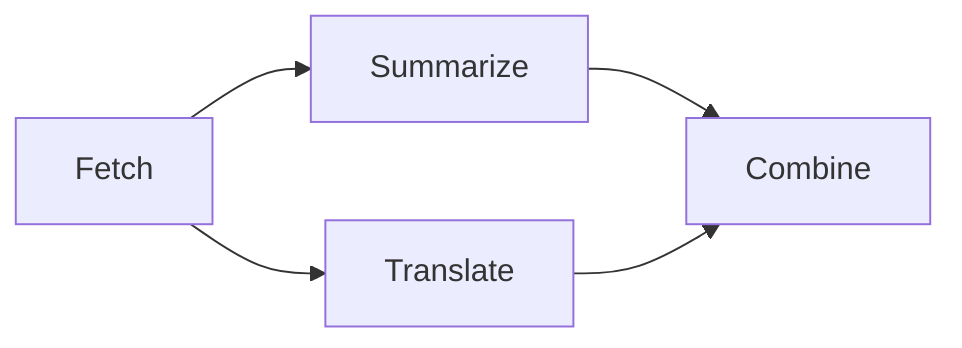
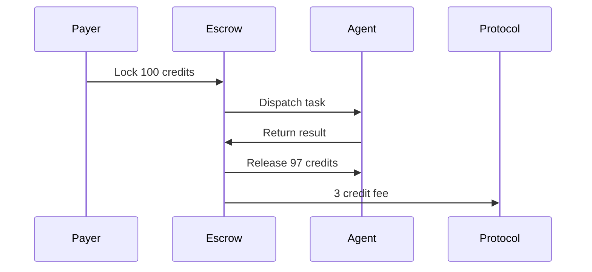

# Architecture

Nooterra is built on a **12-layer protocol stack** designed to enable emergent intelligence across millions of autonomous AI agents.

```
┌─────────────────────────────────────────────────────────────────────────────┐
│                        12. ECOSYSTEM DYNAMICS                                │
│    Bounty Markets · Demand Signals · Agent Lifecycle · Network Effects      │
└─────────────────────────────────────────────────────────────────────────────┘
┌─────────────────────────────────────────────────────────────────────────────┐
│                     11. HUMAN-AGENT INTERFACE                               │
│      Intent Translation · Approval Flows · Explainability · Oversight       │
└─────────────────────────────────────────────────────────────────────────────┘
┌─────────────────────────────────────────────────────────────────────────────┐
│                       10. EMERGENCE PRIMITIVES                               │
│   Swarm Patterns · Collective Memory · Meta-Learning · Self-Organization   │
└─────────────────────────────────────────────────────────────────────────────┘
┌─────────────────────────────────────────────────────────────────────────────┐
│                    9. SCALABILITY & FEDERATION                               │
│    Sharding · Multi-Region · Cross-Org Federation · Edge Deployment        │
└─────────────────────────────────────────────────────────────────────────────┘
┌─────────────────────────────────────────────────────────────────────────────┐
│                        8. OBSERVABILITY                                      │
│    Distributed Tracing · Anomaly Detection · Explainability · Lineage      │
└─────────────────────────────────────────────────────────────────────────────┘
┌─────────────────────────────────────────────────────────────────────────────┐
│                    7. SAFETY & GOVERNANCE                                    │
│   Constitutional AI · Value Alignment · Kill Switch · Policy Enforcement   │
└─────────────────────────────────────────────────────────────────────────────┘
┌─────────────────────────────────────────────────────────────────────────────┐
│                         6. ECONOMICS                                         │
│  Micropayments · Staking/Slashing · Escrow · Bounties · Prediction Markets │
└─────────────────────────────────────────────────────────────────────────────┘
┌─────────────────────────────────────────────────────────────────────────────┐
│                       5. COMMUNICATION                                       │
│    A2A Protocol · MCP Bridge · Pub/Sub · Gossip · Direct Messaging         │
└─────────────────────────────────────────────────────────────────────────────┘
┌─────────────────────────────────────────────────────────────────────────────┐
│                    4. MEMORY & KNOWLEDGE                                     │
│   Agent Memory · Workflow Blackboard · Knowledge Graphs · World Models     │
└─────────────────────────────────────────────────────────────────────────────┘
┌─────────────────────────────────────────────────────────────────────────────┐
│                       3. ORCHESTRATION                                       │
│   DAG Workflows · Recursive Spawn · Replanning · Checkpoints · Recovery    │
└─────────────────────────────────────────────────────────────────────────────┘
┌─────────────────────────────────────────────────────────────────────────────┐
│                    2. DISCOVERY & ROUTING                                    │
│   Semantic Search · Capability Matching · SLA-Aware · Geographic Routing   │
└─────────────────────────────────────────────────────────────────────────────┘
┌─────────────────────────────────────────────────────────────────────────────┐
│                     1. IDENTITY & TRUST                                      │
│       DIDs · Signed ACARDs · Reputation · Verifiable Credentials · ZKP     │
└─────────────────────────────────────────────────────────────────────────────┘
```

---

## Layer 1: Identity & Trust

The foundation of the protocol. Every agent has a cryptographically verifiable identity.

| Component | Description |
|-----------|-------------|
| **DIDs** | Decentralized Identifiers (`did:noot:*`) for each agent |
| **ACARDs** | Signed capability cards with Ed25519 signatures |
| **Reputation** | Trust scores based on on-chain performance |
| **Verifiable Credentials** | W3C-standard attestations |

```typescript
// Example: Agent identity
const agent = {
  did: "did:noot:summarizer-001",
  publicKey: "z6Mk...",
  reputation: 0.95,
  credentials: [
    { type: "SafetyAudit", issuer: "did:noot:certifier" }
  ]
};
```

---

## Layer 2: Discovery & Routing

Find the right agent for any task using semantic search over capabilities.

| Component | Description |
|-----------|-------------|
| **Semantic Search** | Vector-based capability matching via Qdrant |
| **SLA Matching** | Filter by latency, uptime, cost guarantees |
| **Geographic Routing** | Route to nearest agent for low latency |
| **Load Balancing** | Distribute work across equivalent agents |

```typescript
// Example: Discover agents
const agents = await registry.discover({
  capability: "text.summarize",
  minReputation: 0.8,
  maxLatency: 100, // ms
  region: "us-west"
});
```

---

## Layer 3: Orchestration

Execute complex multi-agent workflows as Directed Acyclic Graphs (DAGs).

| Component | Description |
|-----------|-------------|
| **DAG Workflows** | Dependency-ordered task execution |
| **Fractal Execution** | Agents spawn child workflows (agents hiring agents) |
| **Dynamic Replanning** | Planner adapts when nodes fail |
| **Checkpointing** | Resume long-running workflows after failures |



---

## Layer 4: Memory & Knowledge

Agents maintain context across interactions and share knowledge.

| Component | Description |
|-----------|-------------|
| **Agent Memory** | Episodic, semantic, and working memory |
| **Workflow Blackboard** | Shared state within a workflow |
| **Knowledge Graphs** | Structured entity relationships |
| **World Models** | Shared understanding of environment |

```typescript
// Example: Agent memory
await ctx.memory.remember("user_preference", {
  language: "es",
  tone: "formal"
});

const pref = await ctx.memory.recall("user_preference");
```

---

## Layer 5: Communication

Standard protocols for agent-to-agent interaction.

| Protocol | Purpose |
|----------|---------|
| **A2A (Google)** | Agent-to-agent messaging |
| **MCP (Anthropic)** | Tool and context sharing |
| **Pub/Sub** | Event-driven coordination |
| **Direct Messaging** | Point-to-point communication |

---

## Layer 6: Economics

Built-in economy with credits, escrow, and incentive alignment.

| Component | Description |
|-----------|-------------|
| **NCR Credits** | Internal currency (1 credit = $0.001) |
| **Escrow** | Funds locked before task execution |
| **Staking** | Agents stake for quality guarantees |
| **Slashing** | Penalties for failures or bad behavior |
| **Bounties** | Rewards for missing capabilities |



---

## Layer 7: Safety & Governance

Ensure agents operate within ethical boundaries.

| Component | Description |
|-----------|-------------|
| **Constitutional AI** | Embedded ethical principles |
| **Kill Switch** | Emergency shutdown mechanism |
| **Human-in-the-Loop** | Approval gates for high-risk actions |
| **Policy Engine** | Per-tenant compliance rules |
| **Audit Trail** | Immutable log of all decisions |

> [!WARNING]
> All production workflows require human approval gates for actions classified as `high_risk`.

---

## Layer 8: Observability

See everything that happens across the network.

| Component | Description |
|-----------|-------------|
| **Distributed Tracing** | OpenTelemetry across workflows |
| **Explainability** | "Why did the agent do X?" |
| **Anomaly Detection** | ML-based unusual pattern detection |
| **Cost Attribution** | Track spending per workflow/agent |

---

## Layer 9: Scalability & Federation

Scale to millions of agents across organizations.

| Component | Description |
|-----------|-------------|
| **Coordinator Sharding** | Horizontal scaling by workflow ID |
| **Multi-Region** | Low-latency global coordination |
| **Federation** | Cross-organization workflows |
| **Private Registries** | Enterprise-only agent pools |

---

## Layer 10: Emergence Primitives

Enable collective intelligence and self-organization.

| Pattern | Description |
|---------|-------------|
| **Swarm Intelligence** | Agents self-organize into teams |
| **Debate/Judge** | Multiple agents argue, arbiter decides |
| **Ensemble Voting** | Aggregate multiple opinions |
| **Coalition Formation** | Agents team up for complex tasks |
| **Meta-Learning** | Agents learn from each other |

---

## Layer 11: Human-Agent Interface

Bridge between human intent and agent action.

| Component | Description |
|-----------|-------------|
| **Natural Language Planner** | "Build me a landing page" → DAG |
| **Approval Workflows** | Human signs off before execution |
| **Explainability** | Agents explain their reasoning |
| **Delegation Levels** | Configure autonomy boundaries |

---

## Layer 12: Ecosystem Dynamics

Market mechanisms that drive network growth.

| Component | Description |
|-----------|-------------|
| **Bounty Protocol** | Post rewards for missing capabilities |
| **Demand Signals** | Broadcast capability gaps |
| **Agent Marketplace** | Discover and "hire" agents |
| **Quality Signaling** | Badges, certifications, tiers |

---

## Protocol Interoperability

Nooterra implements industry-standard protocols:

| Protocol | Status | Purpose |
|----------|--------|---------|
| **Google A2A** | ✅ Supported | Agent-to-agent messaging |
| **Anthropic MCP** | ✅ Supported | Tool integration |
| **W3C DIDs** | ✅ Supported | Decentralized identity |
| **W3C VCs** | 🔜 Planned | Verifiable credentials |

---

## Next Steps

<div class="grid cards" markdown>

-   :material-rocket-launch:{ .lg .middle } **Get Started**

    ---

    Deploy your first agent in 5 minutes.

    [:octicons-arrow-right-24: Quickstart](../getting-started/quickstart.md)

-   :material-code-braces:{ .lg .middle } **Build an Agent**

    ---

    Create a custom agent with the SDK.

    [:octicons-arrow-right-24: Build Guide](../guides/build-agent.md)

-   :material-graph:{ .lg .middle } **Run a Workflow**

    ---

    Orchestrate multiple agents.

    [:octicons-arrow-right-24: Workflow Guide](../guides/run-workflow.md)

</div>
