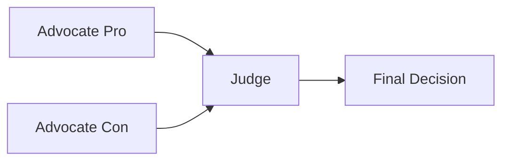
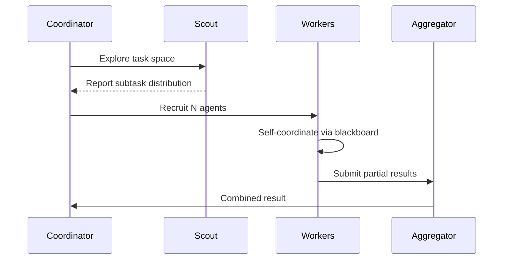
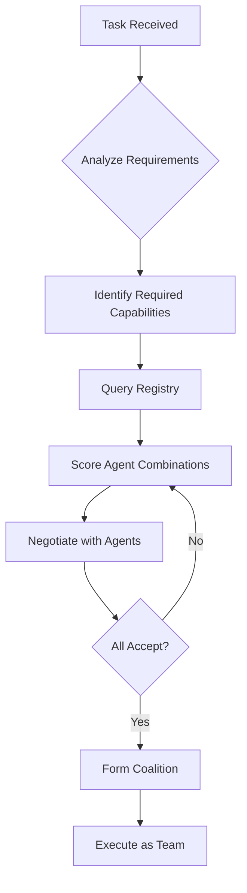

# Emergence Patterns

Enable collective intelligence through multi-agent coordination patterns.

---

## What is Emergent Intelligence?

> **Emergent intelligence** arises when multiple agents interact, producing capabilities that exceed the sum of individual contributions.

```
Individual Agents         Coordinated Agents           Emergent Intelligence
    🤖  🤖  🤖                🤖─🤖─🤖                   ┌─────────────────┐
                                 │                        │  Capabilities   │
    Isolated               🤖─🤖─🤖─🤖                   │  beyond any     │
    capabilities                 │                        │  single agent   │
                              🤖─🤖                       └─────────────────┘
```

---

## 1. Debate Pattern

Multiple agents argue a position, an arbiter makes the final decision.

### When to Use

- Complex decisions with tradeoffs
- Reducing hallucination through adversarial checking
- Exploring multiple perspectives

### Workflow Structure

```yaml
nodes:
  advocate_pro:
    capabilityId: cap.reason.advocate.v1
    payload:
      position: "for"
      topic: "Should we adopt this approach?"
      
  advocate_con:
    capabilityId: cap.reason.advocate.v1
    payload:
      position: "against"
      topic: "Should we adopt this approach?"
      
  judge:
    capabilityId: cap.reason.judge.v1
    dependsOn: [advocate_pro, advocate_con]
    inputMappings:
      arguments_for: "$.advocate_pro.result"
      arguments_against: "$.advocate_con.result"
```

### Flow



---

## 2. Ensemble Voting

Aggregate opinions from multiple agents to reduce errors.

### When to Use

- Classification tasks
- Fact verification
- Confidence calibration

### Implementation

```typescript
const nodes = {
  classifier_1: {
    capabilityId: "cap.classify.v1",
    payload: { text: inputText, model: "model-a" }
  },
  classifier_2: {
    capabilityId: "cap.classify.v1",
    payload: { text: inputText, model: "model-b" }
  },
  classifier_3: {
    capabilityId: "cap.classify.v1",
    payload: { text: inputText, model: "model-c" }
  },
  aggregator: {
    capabilityId: "cap.vote.aggregate.v1",
    dependsOn: ["classifier_1", "classifier_2", "classifier_3"],
    payload: { strategy: "majority" }
  }
};
```

### Aggregation Strategies

| Strategy | Description |
|----------|-------------|
| `majority` | Most common answer wins |
| `weighted` | Weight by agent reputation |
| `unanimous` | All must agree |
| `confidence` | Highest confidence wins |

---

## 3. Swarm Pattern

Agents self-organize into dynamic teams based on task demands.

### When to Use

- Large-scale parallel processing
- Adaptive workload distribution
- Resilient task completion

### How It Works



### Configuration

```yaml
swarm:
  min_workers: 3
  max_workers: 10
  scaling_policy: demand  # or: fixed, adaptive
  coordination: blackboard  # or: message_passing
  timeout_per_worker: 30000
```

---

## 4. Coalition Formation

Agents dynamically team up for complex tasks.

### When to Use

- Multi-capability requirements
- Specialized agent cooperation
- Resource pooling

### Example: Research Task

```yaml
# A research coalition might form:
coalition:
  - did:noot:web-searcher      # Capability: cap.web.search
  - did:noot:pdf-reader        # Capability: cap.document.parse
  - did:noot:summarizer        # Capability: cap.text.summarize
  - did:noot:fact-checker      # Capability: cap.verify.facts
```

### Formation Protocol



---

## 5. Blackboard Coordination

Indirect coordination through shared state.

### When to Use

- Loosely coupled agents
- Incremental problem solving
- Asynchronous collaboration

### Pattern

```typescript
// Agent 1: Research Agent
await ctx.blackboard.append("research_findings", {
  source: "academic_papers",
  findings: [...],
  confidence: 0.9
});

// Agent 2: Market Agent (runs in parallel)
await ctx.blackboard.append("market_data", {
  source: "market_analysis",
  data: [...],
  timestamp: Date.now()
});

// Agent 3: Synthesis Agent (waits for both)
const research = await ctx.blackboard.get("research_findings");
const market = await ctx.blackboard.get("market_data");
const synthesis = await combine(research, market);
```

---

## 6. Reflection Loop

Agents critique and improve their own outputs.

### When to Use

- Quality-critical outputs
- Complex reasoning tasks
- Reducing errors

### Implementation

```yaml
nodes:
  generate:
    capabilityId: cap.generate.v1
    payload: { prompt: "..." }
    
  critique:
    capabilityId: cap.critique.v1
    dependsOn: [generate]
    inputMappings:
      draft: "$.generate.result"
      criteria: ["accuracy", "clarity", "completeness"]
      
  revise:
    capabilityId: cap.revise.v1
    dependsOn: [generate, critique]
    inputMappings:
      original: "$.generate.result"
      feedback: "$.critique.result"
```

### Multi-Round Reflection

```typescript
let result = await generate(input);
for (let round = 0; round < 3; round++) {
  const critique = await selfCritique(result);
  if (critique.score > 0.9) break;
  result = await revise(result, critique.feedback);
}
return result;
```

---

## 7. Meta-Learning

Agents learn from each other's successes.

### How It Works

1. **Observe** — Monitor successful workflow patterns
2. **Extract** — Identify what made them successful
3. **Share** — Broadcast learnings to collective memory
4. **Apply** — Other agents incorporate learnings

### Collective Knowledge Store

```typescript
// After successful task
await collectiveMemory.share({
  pattern: "research_synthesis",
  context: taskContext,
  approach: successfulApproach,
  outcome: { accuracy: 0.95, latency: 2000 }
});

// Before new task
const relevant = await collectiveMemory.query({
  pattern: "research_synthesis",
  similarity: 0.8
});
```

---

## Combining Patterns

Patterns can be composed:

```yaml
# Debate + Ensemble + Reflection
nodes:
  # Multiple advocates
  advocate_1: { ... }
  advocate_2: { ... }
  advocate_3: { ... }
  
  # Debate synthesis
  synthesize:
    dependsOn: [advocate_1, advocate_2, advocate_3]
    capabilityId: cap.synthesize.v1
    
  # Self-critique
  critique:
    dependsOn: [synthesize]
    capabilityId: cap.critique.v1
    
  # Final revision
  final:
    dependsOn: [synthesize, critique]
    capabilityId: cap.revise.v1
```

---

## Best Practices

### Do

- ✅ Start simple, add agents as needed
- ✅ Use blackboard for loose coupling
- ✅ Set timeout limits for agent responses
- ✅ Implement fallbacks for agent failures

### Don't

- ❌ Over-coordinate small tasks
- ❌ Create circular dependencies
- ❌ Ignore agent failures silently
- ❌ Let swarms grow unbounded

---

## Example: AI Research Assistant

```yaml
intent: "Research and summarize recent AI safety papers"

nodes:
  search:
    capabilityId: cap.web.search.v1
    payload: { query: "AI safety research 2024" }
    
  fetch_papers:
    capabilityId: cap.web.fetch.v1
    dependsOn: [search]
    
  summarize_1:
    capabilityId: cap.summarize.v1
    dependsOn: [fetch_papers]
    payload: { focus: "techniques" }
    
  summarize_2:
    capabilityId: cap.summarize.v1
    dependsOn: [fetch_papers]
    payload: { focus: "findings" }
    
  synthesize:
    capabilityId: cap.synthesize.v1
    dependsOn: [summarize_1, summarize_2]
    
  fact_check:
    capabilityId: cap.verify.v1
    dependsOn: [synthesize]
    
  final_review:
    capabilityId: cap.human.review.v1
    dependsOn: [fact_check]
    requiresHuman: true
```

Result: A multi-agent workflow that researches, summarizes from multiple angles, fact-checks, and requires human approval — exhibiting emergent research capabilities beyond any single agent.
