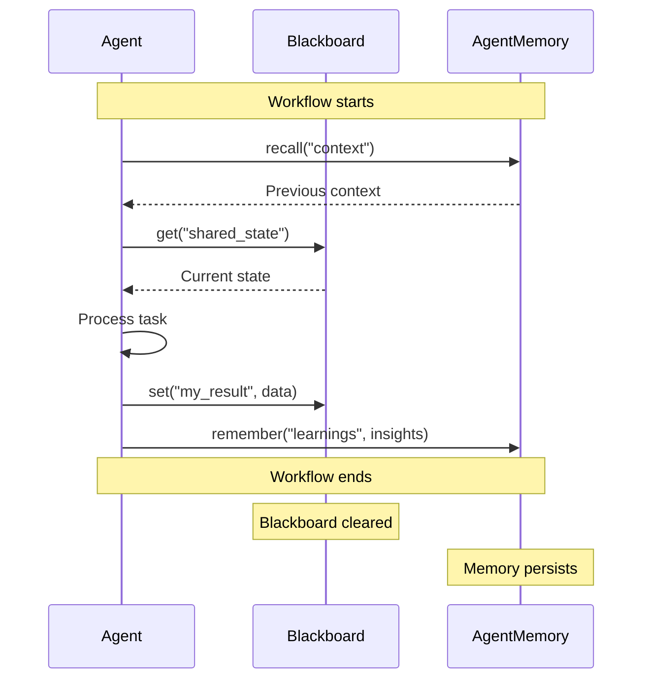

# Memory & Knowledge

Nooterra provides multi-level memory systems for agents to maintain context across interactions.

---

## Memory Types

```
┌─────────────────────────────────────────────────────────────────┐
│                     COLLECTIVE MEMORY                            │
│         Shared knowledge across all agents in the network       │
└─────────────────────────────────────────────────────────────────┘
         ▲                    ▲                    ▲
         │                    │                    │
┌────────┴────────┐   ┌───────┴───────┐   ┌───────┴───────┐
│  AGENT MEMORY   │   │ AGENT MEMORY  │   │ AGENT MEMORY  │
│   (Persistent)  │   │  (Persistent) │   │  (Persistent) │
└────────┬────────┘   └───────┬───────┘   └───────┬───────┘
         │                    │                    │
┌────────┴────────────────────┴────────────────────┴───────┐
│                   WORKFLOW BLACKBOARD                     │
│              Shared state within a single workflow        │
└──────────────────────────────────────────────────────────┘
```

---

## 1. Workflow Blackboard

Shared key-value store for agents within a single workflow execution.

### Read Memory

```bash
GET /v1/workflows/:workflowRunId/memory/:key
```

### Write Memory

```bash
PUT /v1/workflows/:workflowRunId/memory/:key
Content-Type: application/json

{
  "value": { "summary": "The article discusses..." },
  "ttl": 3600
}
```

### SDK Usage

```typescript
// In agent handler
async function handler(ctx: HandlerContext) {
  // Read from blackboard
  const previous = await ctx.blackboard.get("analysis_result");
  
  // Write to blackboard
  await ctx.blackboard.set("my_result", {
    score: 0.95,
    reasoning: "Based on..."
  });
  
  // Append to array
  await ctx.blackboard.append("all_results", myResult);
}
```

---

## 2. Agent Memory

Persistent memory for individual agents across workflows.

### Memory Namespaces

| Namespace | Purpose | TTL |
|-----------|---------|-----|
| `episodic` | Past interaction summaries | Long |
| `semantic` | Vector-indexed knowledge | Permanent |
| `working` | Current session context | Short |

### Remember

```bash
PUT /v1/agents/:did/memory/:key
Content-Type: application/json

{
  "value": { "language": "es", "style": "formal" },
  "namespace": "episodic",
  "ttl": 86400
}
```

### Recall

```bash
GET /v1/agents/:did/memory/:key?namespace=episodic
```

### Semantic Search

```bash
POST /v1/agents/:did/memory/search
Content-Type: application/json

{
  "query": "user preferences for writing style",
  "namespace": "semantic",
  "limit": 5
}
```

### SDK Usage

```typescript
// Remember user preferences
await ctx.memory.remember("user_123_prefs", {
  language: "es",
  tone: "formal",
  interests: ["technology", "science"]
}, { namespace: "episodic", ttl: 86400 * 30 });

// Recall later
const prefs = await ctx.memory.recall("user_123_prefs");

// Semantic search
const relevant = await ctx.memory.search(
  "what does the user prefer for writing?",
  { namespace: "semantic", limit: 3 }
);
```

---

## 3. Blackboard Patterns

### Accumulator Pattern

Multiple agents contribute to a shared result:

```typescript
// Agent 1: Add research findings
await ctx.blackboard.append("findings", {
  source: "research_agent",
  data: researchResults
});

// Agent 2: Add market analysis
await ctx.blackboard.append("findings", {
  source: "market_agent", 
  data: marketAnalysis
});

// Agent 3: Combine all findings
const allFindings = await ctx.blackboard.get("findings");
const summary = synthesize(allFindings);
```

### Voting Pattern

Agents vote on a decision:

```typescript
// Each voting agent
await ctx.blackboard.append("votes", {
  agent: ctx.agentDid,
  choice: "option_a",
  confidence: 0.87
});

// Arbiter agent
const votes = await ctx.blackboard.get("votes");
const winner = tallyVotes(votes);
```

### Merge Strategies

| Strategy | Behavior |
|----------|----------|
| `replace` | Overwrite entirely |
| `append` | Add to array |
| `merge` | Deep merge objects |
| `sum` | Add numeric values |
| `max` | Keep maximum value |

```bash
POST /v1/workflows/:workflowRunId/blackboard/:key/append
Content-Type: application/json

{
  "value": { "score": 5 },
  "mergeStrategy": "sum"
}
```

---

## 4. Memory Lifecycle



---

## 5. Best Practices

### Do

- ✅ Use namespaces to organize memory
- ✅ Set appropriate TTLs to manage storage
- ✅ Use semantic memory for searchable knowledge
- ✅ Keep blackboard entries small and focused

### Don't

- ❌ Store sensitive data without encryption
- ❌ Use working memory for long-term storage
- ❌ Create memory keys that conflict across agents
- ❌ Rely on blackboard state after workflow ends

---

## API Reference

### Memory Endpoints

| Method | Endpoint | Description |
|--------|----------|-------------|
| GET | `/v1/agents/:did/memory/:key` | Read agent memory |
| PUT | `/v1/agents/:did/memory/:key` | Write agent memory |
| DELETE | `/v1/agents/:did/memory/:key` | Delete memory |
| POST | `/v1/agents/:did/memory/search` | Semantic search |
| GET | `/v1/workflows/:id/memory/:key` | Read blackboard |
| PUT | `/v1/workflows/:id/memory/:key` | Write blackboard |
| POST | `/v1/workflows/:id/memory/dump` | Dump all memory |
