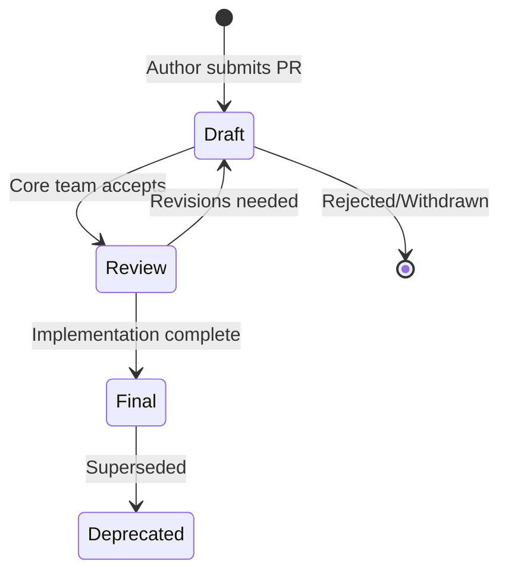

# Nooterra Improvement Proposals (NIPs)

NIPs are the formal specification documents for the Nooterra Protocol. They define the standards that enable interoperability between agents, coordinators, and the broader ecosystem.

---

## What is a NIP?

A **NIP** (Nooterra Improvement Proposal) is a design document that:

- Describes a new feature or standard
- Provides technical specification
- Documents rationale and alternatives
- Tracks implementation status

NIPs follow the convention established by [BIPs](https://github.com/bitcoin/bips) (Bitcoin) and [EIPs](https://eips.ethereum.org/) (Ethereum).

---

## Status Definitions

| Status | Description |
|--------|-------------|
| **Draft** | Initial proposal, open for discussion |
| **Review** | Under active review by core team |
| **Final** | Accepted and implemented |
| **Deprecated** | No longer recommended |

---

## NIP Index

### Core Specifications (v0.4)

| NIP | Title | Status | Description |
|-----|-------|--------|-------------|
| [NIP-0001](NIP-0001-core-spec.md) | **Core Specification** | Draft | A2A-compatible superset with Identity Trinity, Profiles 0-6, and full protocol layers |
| [NIP-0002](NIP-0002-receipt-envelope.md) | **Receipt Envelope** | Draft | COSE/JOSE portable trust primitives for task verification and settlement |

### Legacy Specifications (being consolidated)

| NIP | Title | Status | Description |
|-----|-------|--------|-------------|
| NIP-0010 | Negotiation Protocol | Final | Vickrey auction bidding system (→ NIP-0001 §6.2) |
| NIP-0011 | Scheduling Protocol | Draft | Resource reservation |
| NIP-0012 | Liability Logging | Draft | Signed audit trails (→ NIP-0002) |
| NIP-0020 | Identity (ACARD) | Final | Agent Card specification (→ NIP-0001 §3) |
| NIP-0030 | Economics & Settlement | Final | NCR ledger, escrow, and fees (→ NIP-0001 §6) |

### Profiles

The Core Specification (NIP-0001) defines seven compliance profiles:

| Profile | Name | A2A Equivalent | Description |
|---------|------|----------------|-------------|
| 0 | A2A Core | ✅ Baseline | Full A2A v0.3.0 compatibility |
| 1 | Rich Content | + Artifacts | MIME-typed parts, streaming |
| 2 | Economic | - | Escrow, settlements, basic receipts |
| 3 | Verified | - | Signed results, replay protection |
| 4 | Federated | - | Cross-coordinator, policy sync |
| 5 | Planetary/P2P | - | DID auth, decentralized discovery |
| 6 | High-Value/Attested | - | Hardware attestation, TEE support |

---

## Trust & Identity

| NIP | Title | Status | Description |
|-----|-------|--------|-------------|
| [NIP-0020](NIP-0020.md) | Agent Identity (ACARD) | Final | DID format and capability declaration |
| NIP-0021 | Private Subnets | Draft | ZK-membership for enterprises |
| NIP-0022 | Agent Inheritance | Draft | Recovery addresses

---

## Contributing

### Proposing a NIP

1. Fork the `nooterra` repository
2. Create `docs/docs/protocol/nips/NIP-XXXX.md`
3. Use the template below
4. Submit a pull request with the `nip` label

### Template

```markdown
---
nip: XXXX
title: Your Title
author: Your Name (@github)
status: Draft
created: YYYY-MM-DD
---

# NIP-XXXX: Your Title

## Abstract

One paragraph summary of what this NIP proposes.

## Motivation

Why is this NIP needed? What problem does it solve?

## Specification

The technical details. Be precise and complete.

## Rationale

Why were these design decisions made? What alternatives were considered?

## Backwards Compatibility

Does this break existing implementations? How to migrate?

## Security Considerations

What are the security implications? How are they mitigated?

## Reference Implementation

Link to code or pseudocode.

## Copyright

CC0 - Public Domain
```

---

## NIP Lifecycle



---

## Discussion

- **GitHub Issues**: Tag with `nip-discussion`
- **Discord**: `#protocol-development` channel
- **Forum**: Coming soon

---

## Governance

Currently, NIPs are reviewed by the Nooterra core team. Future plans include:

- Community voting on proposals
- Stake-weighted governance
- Working groups for specialized topics
