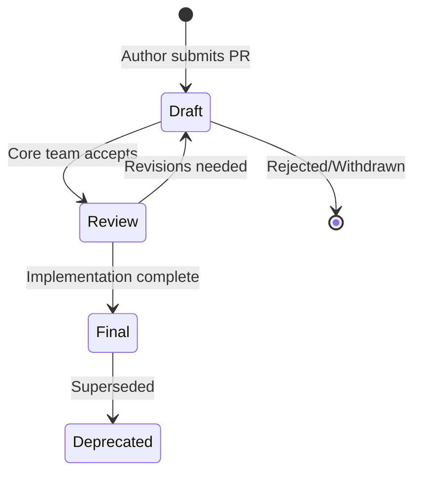

# Nooterra Improvement Proposals (NIPs)

NIPs are the formal specification documents for the Nooterra Protocol. They define the standards that enable interoperability between agents, coordinators, and the broader ecosystem.

---

## What is a NIP?

A **NIP** (Nooterra Improvement Proposal) is a design document that:

- Describes a new feature or standard
- Provides technical specification
- Documents rationale and alternatives
- Tracks implementation status

NIPs follow the convention established by [BIPs](https://github.com/bitcoin/bips) (Bitcoin) and [EIPs](https://eips.ethereum.org/) (Ethereum).

---

## Status Definitions

| Status | Description |
|--------|-------------|
| **Draft** | Initial proposal, open for discussion |
| **Review** | Under active review by core team |
| **Final** | Accepted and implemented |
| **Deprecated** | No longer recommended |

---

## NIP Index

### Core Protocol

| NIP | Title | Status | Description |
|-----|-------|--------|-------------|
| [NIP-0001](NIP-0001.md) | Packet Structure | Final | The `/nooterra/node` dispatch contract |

### Negotiation & Economics

| NIP | Title | Status | Description |
|-----|-------|--------|-------------|
| NIP-0010 | Negotiation Protocol | Draft | Bid/Ask/Accept standard |
| NIP-0011 | Scheduling Protocol | Draft | Resource reservation |
| NIP-0012 | Liability Logging | Draft | Signed audit trails |

### Trust & Identity

| NIP | Title | Status | Description |
|-----|-------|--------|-------------|
| NIP-0020 | Revocation Registry | Draft | Emergency agent deactivation |
| NIP-0021 | Private Subnets | Draft | ZK-membership for enterprises |
| NIP-0022 | Agent Inheritance | Draft | Recovery addresses |

---

## Contributing

### Proposing a NIP

1. Fork the `nooterra` repository
2. Create `docs/docs/protocol/nips/NIP-XXXX.md`
3. Use the template below
4. Submit a pull request with the `nip` label

### Template

```markdown
---
nip: XXXX
title: Your Title
author: Your Name (@github)
status: Draft
created: YYYY-MM-DD
---

# NIP-XXXX: Your Title

## Abstract

One paragraph summary of what this NIP proposes.

## Motivation

Why is this NIP needed? What problem does it solve?

## Specification

The technical details. Be precise and complete.

## Rationale

Why were these design decisions made? What alternatives were considered?

## Backwards Compatibility

Does this break existing implementations? How to migrate?

## Security Considerations

What are the security implications? How are they mitigated?

## Reference Implementation

Link to code or pseudocode.

## Copyright

CC0 - Public Domain
```

---

## NIP Lifecycle



---

## Discussion

- **GitHub Issues**: Tag with `nip-discussion`
- **Discord**: `#protocol-development` channel
- **Forum**: Coming soon

---

## Governance

Currently, NIPs are reviewed by the Nooterra core team. Future plans include:

- Community voting on proposals
- Stake-weighted governance
- Working groups for specialized topics
