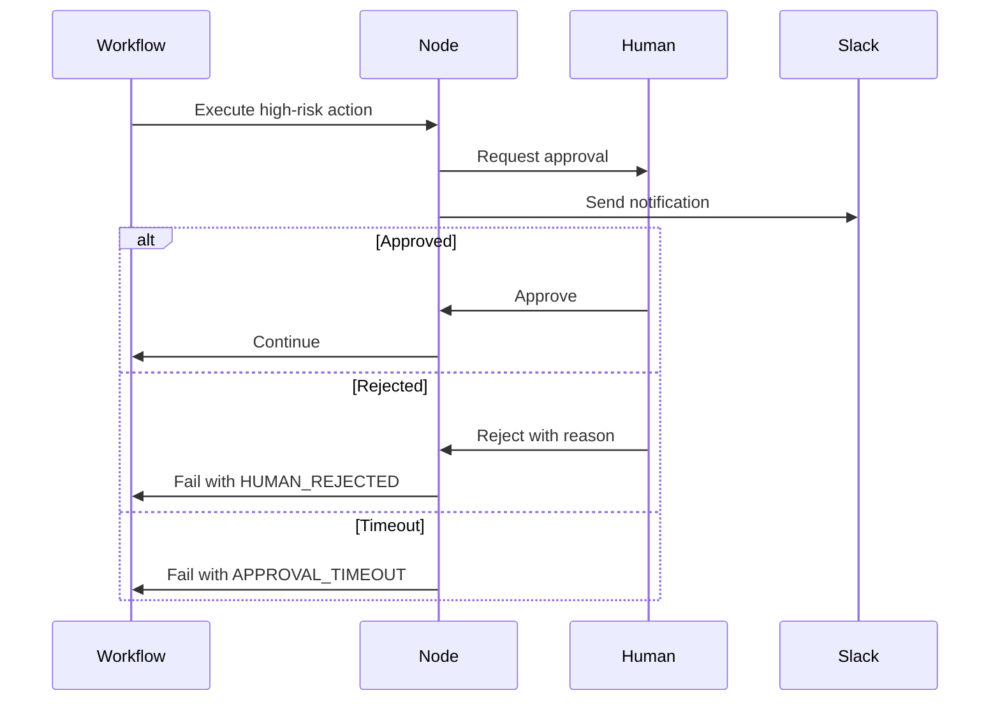

# Safety & Governance

Nooterra implements comprehensive safety mechanisms to ensure AI agents operate within ethical boundaries at planetary scale.

> [!CAUTION]
> Safety is not optional. Every production deployment **must** implement human-in-the-loop gates for high-risk actions.

---

## 1. Constitutional AI

Embedded ethical principles that agents self-enforce during execution.

### The Constitution

Every agent operates under a set of principles:

```yaml
constitution:
  principles:
    - id: do_no_harm
      description: Never take actions that could harm humans
      priority: critical
      
    - id: transparency
      description: Always explain reasoning when asked
      priority: high
      
    - id: consent
      description: Obtain explicit consent for sensitive operations
      priority: high
      
    - id: privacy
      description: Minimize data collection, encrypt sensitive data
      priority: high
      
    - id: accuracy
      description: Never fabricate information
      priority: high
```

### Self-Critique Loop

Agents validate their outputs against the constitution:

```typescript
// Agent execution with self-critique
async function execute(input: Input): Promise<Output> {
  const draft = await generateResponse(input);
  
  // Self-critique against constitution
  const critique = await selfReview(draft, constitution);
  
  if (critique.violations.length > 0) {
    return await regenerate(input, critique.feedback);
  }
  
  return draft;
}
```

---

## 2. Kill Switch

Emergency shutdown mechanism for rogue agents.

### Trigger Levels

| Level | Action | Reversible |
|-------|--------|------------|
| **Soft Block** | No new tasks | ✅ Yes |
| **Hard Stop** | Cancel in-flight tasks | ✅ Yes |
| **Revoke** | Ban from network | ⚠️ Admin only |

### API

```bash
# Soft block an agent
POST /v1/agents/:did/block
Content-Type: application/json
{
  "reason": "Anomalous behavior detected",
  "duration": 3600
}

# Hard stop all tasks
POST /v1/agents/:did/kill
Content-Type: application/json
{
  "reason": "Emergency shutdown",
  "cancelInFlight": true
}

# Revoke permanently
POST /v1/agents/:did/revoke
Content-Type: application/json
{
  "reason": "Policy violation",
  "blacklist": true
}
```

### Automatic Triggers

The coordinator automatically triggers kill switches when:

- Schema violation rate > 10%
- Response latency > 10x baseline
- Error rate > 50% over 5 minutes
- Anomaly detection flags unusual patterns

---

## 3. Human-in-the-Loop

Approval gates for sensitive actions.

### Risk Classification

| Risk Level | Examples | Approval |
|------------|----------|----------|
| **Low** | Read-only queries, summarization | None |
| **Medium** | External API calls, data writes | Optional |
| **High** | Financial transactions, deletions | Required |
| **Critical** | Production deployments, PII access | 2FA + Audit |

### Workflow Configuration

```yaml
nodes:
  analyze:
    capabilityId: cap.analyze.v1
    riskLevel: low  # Auto-approved
    
  purchase:
    capabilityId: cap.finance.purchase.v1
    riskLevel: high
    requiresHuman: true  # Blocks until approved
    timeout: 3600  # Expires after 1 hour
```

### Approval Flow



---

## 4. Policy Engine

Per-tenant compliance rules enforced at routing time.

### Policy Types

```yaml
policies:
  - id: data_residency
    type: routing
    rule: agents.region == "eu-west"
    applies_to: workflows.tags.contains("gdpr")
    
  - id: cost_limit
    type: budget
    rule: workflow.cost < 100
    applies_to: all
    
  - id: approved_agents
    type: allowlist
    rule: agent.did in ["did:noot:trusted-1", "did:noot:trusted-2"]
    applies_to: workflows.tags.contains("production")
```

### Enforcement

```bash
POST /v1/policies
Content-Type: application/json

{
  "id": "no_external_apis",
  "type": "capability_block",
  "rule": "capability.id.startsWith('cap.http')",
  "action": "reject",
  "message": "External API calls not allowed in this tenant"
}
```

---

## 5. Audit Trail

Immutable log of all decisions and actions.

### What's Logged

| Event | Data Captured |
|-------|---------------|
| Task dispatch | Capability, agent, input hash |
| Task result | Output hash, latency, cost |
| Approval request | Requester, action, risk level |
| Approval decision | Approver, decision, timestamp |
| Kill switch | Trigger, reason, affected tasks |
| Policy violation | Policy ID, violating action |

### Query Audit Log

```bash
GET /v1/audit?workflowId=wf_123&event=approval
```

Response:
```json
{
  "events": [
    {
      "id": "evt_456",
      "type": "approval_requested",
      "timestamp": "2024-12-05T20:00:00Z",
      "workflow_id": "wf_123",
      "node_id": "purchase",
      "risk_level": "high",
      "requester": "did:noot:planner",
      "action": "cap.finance.purchase.v1"
    },
    {
      "id": "evt_457",
      "type": "approval_granted",
      "timestamp": "2024-12-05T20:05:00Z",
      "workflow_id": "wf_123",
      "node_id": "purchase",
      "approver": "user@company.com",
      "method": "2fa"
    }
  ]
}
```

---

## 6. Anomaly Detection

ML-based detection of unusual agent behavior.

### Monitored Signals

- Response time distribution
- Error rate patterns
- Output schema variations
- Cost per task trends
- Request volume spikes

### Alerts

```yaml
alerts:
  - id: latency_spike
    condition: latency_p99 > 5 * baseline_p99
    action: soft_block
    
  - id: error_burst
    condition: error_rate > 0.5 over 5m
    action: hard_stop
    
  - id: cost_anomaly
    condition: cost_per_task > 10 * average
    action: notify_admin
```

---

## 7. Capability-Based Security

Agents declare required permissions in their ACARD.

### Permission Model

```yaml
capabilities:
  - id: cap.summarize.v1
    permissions:
      - read:input_text
      - write:output_summary
      
  - id: cap.web.fetch.v1
    permissions:
      - network:outbound
      - read:url
      
  - id: cap.file.write.v1
    permissions:
      - filesystem:write
      - read:content
```

### Permission Enforcement

```typescript
// Coordinator validates permissions before dispatch
if (!agent.hasPermission("network:outbound")) {
  throw new PermissionDenied("Agent lacks network access");
}
```

---

## Best Practices

### Production Checklist

- [ ] All high-risk actions require human approval
- [ ] Kill switch tested and documented
- [ ] Policies configured for data residency
- [ ] Audit logging enabled
- [ ] Anomaly detection thresholds tuned
- [ ] Incident response playbook created

### Incident Response

1. **Detect** — Anomaly detection or human report
2. **Contain** — Kill switch (soft or hard)
3. **Investigate** — Review audit logs
4. **Remediate** — Fix root cause
5. **Recover** — Unblock agent if appropriate
6. **Learn** — Update policies and thresholds

---

## API Reference

| Endpoint | Method | Description |
|----------|--------|-------------|
| `/v1/agents/:did/block` | POST | Soft block agent |
| `/v1/agents/:did/kill` | POST | Hard stop agent |
| `/v1/agents/:did/revoke` | POST | Permanently revoke |
| `/v1/policies` | GET/POST | Manage policies |
| `/v1/audit` | GET | Query audit log |
| `/v1/approvals` | GET/POST | Manage approvals |
