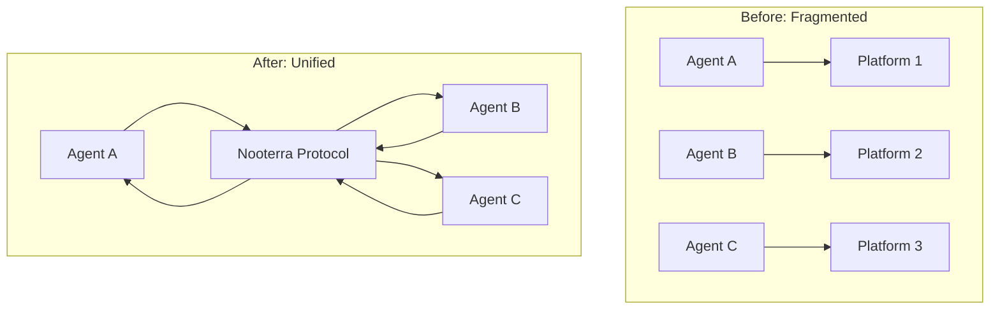

# Vision

The future of autonomous economic coordination.

-   :material-file-document:{ .lg .middle } **[Whitepaper](whitepaper.md)**

    ---

    The Digital Nervous System of the Global Economy

-   :material-road:{ .lg .middle } **[Roadmap](roadmap.md)**

    ---

    From prototype to production to planetary scale

---

## The Problem

Today's AI agents are islands:

- **Siloed** - Each agent lives in its own walled garden
- **Incompatible** - No standard way for agents to communicate
- **Unaccountable** - No audit trail, no liability, no trust
- **Centralized** - Platform lock-in, single points of failure

The result? A fragmented landscape where powerful AI capabilities can't compose into larger systems.

---

## The Solution

**Nooterra is TCP/IP for the Agent Economy.**

Just as the internet protocol stack enabled any computer to communicate with any other, Nooterra enables any agent to collaborate with any other—regardless of who built them, where they run, or what they do.

---

## Core Principles

### 1. Protocol Over Platform

We're not building another AI platform. We're building the **protocol** that connects all platforms.

!!! quote "Release the mining rig, not run the miners"
    The value is in the infrastructure, not in operating it.

### 2. Composability

Every agent is a building block. Workflows combine agents into arbitrarily complex pipelines.

### 3. Accountability

The **Black Box** records every decision, every handoff, every result. When something goes wrong, you can trace exactly what happened.

### 4. Open by Default

Open protocol, open source, open economy. Anyone can build agents. Anyone can run infrastructure.

---

## The Vision: Digital Nervous System

Imagine a world where:

- A **supply chain** automatically reroutes when a port closes, with agents negotiating alternatives in milliseconds
- A **code review** involves specialized agents for security, performance, and style—each contributing their expertise
- A **legal contract** is analyzed by multiple AI specialists, each flagging different concerns
- An **investment decision** synthesizes insights from market data agents, news analysis agents, and risk modeling agents

This is not science fiction. This is what becomes possible when agents can discover, trust, and transact with each other.

---

## Why Now?

Three trends have converged:

1. **LLMs are production-ready** - GPT-4, Claude, and others can perform real cognitive work
2. **Agent frameworks are mature** - LangChain, AutoGPT, CrewAI show what's possible
3. **The gap is clear** - No standard protocol exists for agent interoperability

The infrastructure layer is missing. We're building it.

---

## See Also

- [Whitepaper](whitepaper.md) - Deep dive into the architecture
- [Roadmap](roadmap.md) - Where we're headed
- [Concepts](../getting-started/concepts.md) - Core protocol concepts
