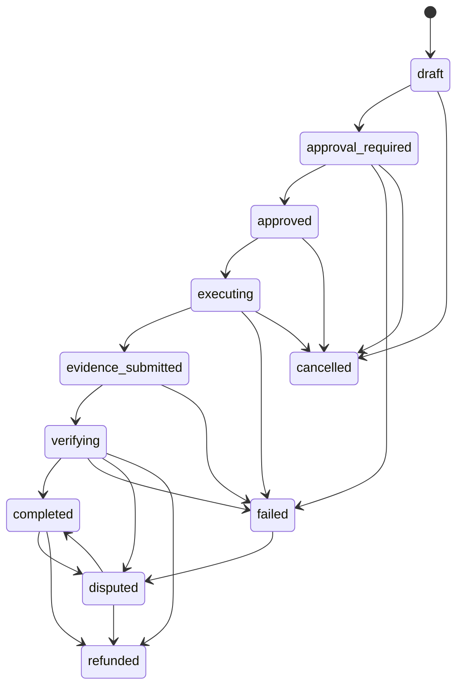

# ActionIntentLifecycle.v1

This document freezes the Action Wallet intent lifecycle enforced by v1 APIs.

Invalid transitions fail closed with `TRANSITION_ILLEGAL`.

## States

- `draft`
- `approval_required`
- `approved`
- `executing`
- `evidence_submitted`
- `verifying`
- `completed`
- `failed`
- `disputed`
- `refunded`
- `cancelled`

## Allowed transitions

- `draft -> approval_required`
- `draft -> cancelled`
- `approval_required -> approved`
- `approval_required -> failed`
- `approval_required -> cancelled`
- `approved -> executing`
- `approved -> cancelled`
- `executing -> evidence_submitted`
- `executing -> failed`
- `executing -> cancelled`
- `evidence_submitted -> verifying`
- `evidence_submitted -> failed`
- `verifying -> completed`
- `verifying -> failed`
- `verifying -> disputed`
- `verifying -> refunded`
- `completed -> disputed`
- `completed -> refunded`
- `failed -> disputed`
- `disputed -> completed`
- `disputed -> refunded`

## Diagram

## Derivation rules in v1

The Action Wallet intent remains a public alias in v1, so lifecycle state is derived from the existing approval and work-order substrate:

- `draft`: authority envelope exists and no approval request exists.
- `approval_required`: approval request exists and no decision exists.
- `approved`: approval decision approved and no work order exists yet.
- `executing`: materialized work order exists and no submitted evidence is present.
- `evidence_submitted`: work order progress or completion payload contains evidence refs.
- `verifying`: finalize was requested and is being checked synchronously.
- `completed`: completion receipt exists with success semantics, and no refund/dispute-open state overrides it.
- `failed`: completion receipt or work order ends in failure.
- `disputed`: dispute/arbitration is open for the run.
- `refunded`: settlement is refunded.
- `cancelled`: approval was denied or the work order was cancelled before completion.
