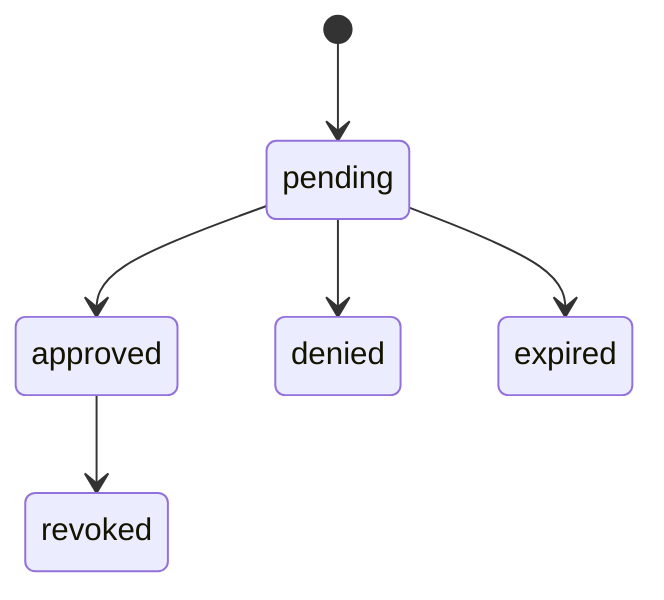

# ApprovalRequestLifecycle.v1

This document freezes the Action Wallet approval lifecycle enforced by v1 APIs.

Invalid transitions fail closed with `TRANSITION_ILLEGAL`.

## States

- `pending`
- `approved`
- `denied`
- `expired`
- `revoked`

## Allowed transitions

- `pending -> approved`
- `pending -> denied`
- `pending -> expired`
- `approved -> revoked`

## Diagram



## Derivation rules in v1

The canonical approval substrate remains `ApprovalRequest.v1` plus an optional `ApprovalDecision.v1`. Public alias routes project the lifecycle as top-level `approvalStatus`.

- `pending`: approval request exists, there is no decision, and the request has not crossed `approvalPolicy.decisionTimeoutAt`.
- `approved`: approval decision exists with `approved=true`, and no active approval revocation marker has taken effect.
- `denied`: approval decision exists with `approved=false`.
- `expired`: approval request has no decision and `approvalPolicy.decisionTimeoutAt` is at or before the evaluation time.
- `revoked`: an approved decision carries `metadata.approvalLifecycle.revokedAt`, and that timestamp is at or before the evaluation time.

## Revocation marker

Until a first-class public revoke route ships, v1 treats approval revocation as an explicit projection marker on the decision metadata:

```json
{
  "approvalLifecycle": {
    "revokedAt": "2026-03-09T00:00:00.000Z",
    "revocationReasonCode": "USER_REVOKED"
  }
}
```
