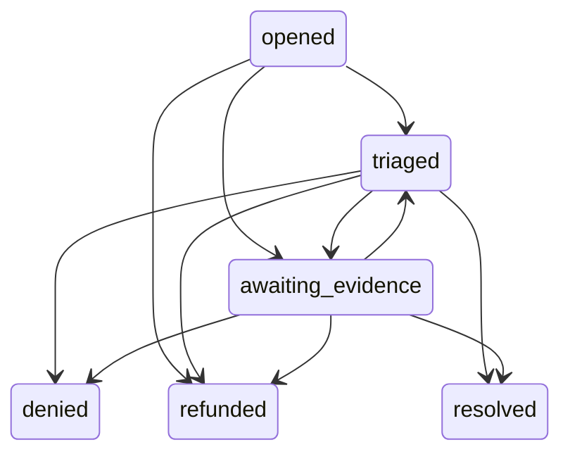

# DisputeCaseLifecycle.v1

This document freezes dispute + arbitration lifecycle behavior enforced by Trust OS v1 APIs.

## Action Wallet alias lifecycle (`DisputeCase.v1`)

The Action Wallet launch surface exposes a public dispute alias over the richer run-settlement and arbitration substrate.

Public states:

- `opened`
- `triaged`
- `awaiting_evidence`
- `refunded`
- `denied`
- `resolved`

Allowed lifecycle:

- `opened -> triaged`
- `opened -> awaiting_evidence`
- `opened -> refunded`
- `triaged -> awaiting_evidence`
- `triaged -> denied`
- `triaged -> refunded`
- `triaged -> resolved`
- `awaiting_evidence -> triaged`
- `awaiting_evidence -> denied`
- `awaiting_evidence -> refunded`
- `awaiting_evidence -> resolved`

Projection rules:

- `opened`: settlement dispute status is `open` and no arbitration case is attached yet.
- `awaiting_evidence`: arbitration exists but hosted dispute evidence is still absent.
- `triaged`: arbitration exists and hosted dispute evidence has been attached.
- `refunded`: dispute is closed and settlement status resolved to `refunded`.
- `denied`: dispute is closed with rejection semantics (`disputeResolution.outcome=rejected` or provider denial).
- `resolved`: dispute is closed and does not map to `refunded` or `denied`.

## Run dispute lifecycle (`AgentRunSettlement.v1`)

State machine:

- `none -> open`
- `closed -> open`
- `open -> closed`

Invalid transitions fail closed with `TRANSITION_ILLEGAL`.

Guard rules:

- Dispute open is allowed only before dispute-window expiry (`DISPUTE_WINDOW_EXPIRED` on expiry).
- `/runs/{runId}/dispute/open` is rejected when settlement is still locked (`status=locked`).
- Dispute close requires an active open dispute (and matching `disputeId` when provided).
- Dispute evidence/escalation updates require an active open dispute.
- Escalation level cannot downgrade an active dispute.

## Arbitration case lifecycle (`ArbitrationCase.v1`)

Statuses:

- `open`
- `under_review`
- `verdict_issued`
- `closed`

Operational transitions:

- Case creation (`action=open` or `action=appeal`) creates case in `under_review`.
- Assignment/evidence paths may advance `open -> under_review`.
- Verdict is accepted only from `open|under_review`, and sets `verdict_issued`.
- Close is accepted only from `verdict_issued`, and sets `closed`.

Invalid transitions fail closed with `TRANSITION_ILLEGAL`.

Guard rules:

- Arbitration open requires parent dispute status `open`.
- Appeal requires parent case in `verdict_issued|closed` and valid parent verdict metadata.
- Verdict and appeal actions are denied after dispute-window expiry (`DISPUTE_WINDOW_EXPIRED`).

## Determinism requirements

- Panel assignment canonicalizes and lexically sorts `panelCandidateAgentIds` before hashing.
- Candidate reordering must not change `assignmentHash` or chosen arbiter.
- Transition/window denials emit stable machine codes for replay automation.
