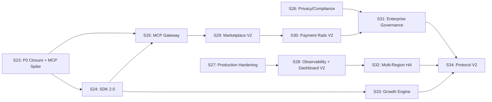

# Sprint S23–S34 Plan

> [!CAUTION]
> **Deprecated as of 2026-02-14.** This is an aspirational roadmap. The current execution plan is **signal-driven** and lives at: `planning/sprints/post-hn-signal-driven.md`.

> **Baseline**: February 12, 2026 · **Sprint length**: 2 weeks · **Horizon**: 12 sprints (24 weeks, ending ~July 2026)

> [!IMPORTANT]
> This plan incorporates 4 hard adjustments:
> 1. **S23 = P0 evidence lock + MCP spike** — hosted-baseline backup/restore evidence must be green before broad MCP rollout
> 2. **Dashboard V2 behind infra hardening** — live dashboard cutover after S27 queue/worker hardening
> 3. **x402 = optional adapter only** — not core dependency, parked to S30+
> 4. **Fail-closed gates per sprint** — every sprint exits with 1 artifact + 1 gate command + 1 runbook link

---

## Sprint Sequence

| Phase | Sprints | Theme |
|-------|---------|-------|
| **P0 closure + protocol foundation** | S23 | P0 evidence + MCP spike |
| **SDK/DX + compliance foundations** | S24–S26 | SDK 2.0, developer portal, privacy/compliance |
| **Production hardening + observability** | S27–S28 | Queue/worker hardening, observability/IR, Dashboard V2 |
| **Marketplace + settlement rails** | S29–S30 | Marketplace V2, global payment rails, x402 adapter (optional) |
| **Enterprise governance + HA** | S31–S32 | Enterprise RBAC/SSO, multi-region HA |
| **Growth engine + protocol v2** | S33–S34 | PLG automation, protocol v2 ecosystem |

---

## Sprint 23 — P0 Closure + MCP Spike

**North star**: All P0 operations evidence is signed and archived. MCP prototype proves the integration path.

Entry criteria alignment:

- S23 follows `planning/sprints/s23-s32-readiness-plan.md`.
- If hosted-baseline backup/restore artifacts are already green, `STLD-T2301/2302` are verification/refresh tasks (not net-new infrastructure work).

| Ticket | Deliverable | Acceptance |
|--------|-------------|------------|
| `STLD-T2301` | **Hosted-baseline backup/restore (staging)** — run hosted-baseline with real DB URLs, archive signed artifacts | `hosted-baseline-staging.json` status=pass with `backupRestore.ok=true` |
| `STLD-T2302` | **Hosted-baseline backup/restore (prod)** — same for production environment | `hosted-baseline-prod.json` status=pass with `backupRestore.ok=true` |
| `STLD-T2303` | **Chargeback evidence packet** — generate and sign chargeback + design-partner packets from automated runs | Artifacts committed, linked from release checklist |
| `STLD-T2304` | **Outbox drain + SLA gauge triage** — drain worker outbox, root-cause SLA gauge alerts | `worker_outbox_pending_total_gauge` near zero; triage tickets created with owners |
| `STLD-T2305` | **MCP server spike** — prototype MCP server exposing Nooterra tools (create agreement, submit evidence, settle, dispute) via `stdio` transport | Agent can discover + invoke tools; spike doc with API surface and latency measurements |
| `STLD-T2306` | **MCP quickstart draft** — rough 5-min tutorial for connecting an agent to the spike server | Draft doc committed; reviewed by 1 external tester |

**Sprint gate**:
- **Artifact**: `artifacts/ops/hosted-baseline-prod.json` (signed, `backupRestore.ok=true`)
- **Gate command**: `npm run ops:hosted-baseline:evidence -- --base-url "$NOOTERRA_BASE_URL" --tenant-id "$NOOTERRA_TENANT_ID" --ops-token "$NOOTERRA_OPS_TOKEN" --environment prod --run-backup-restore true --require-backup-restore true --database-url "$DATABASE_URL" --restore-database-url "$RESTORE_DATABASE_URL" --out ./artifacts/ops/hosted-baseline-prod.json`
- **Runbook**: `docs/ops/HOSTED_BASELINE_R2.md`

---

## Sprint 24 — Developer Experience + SDK 2.0

**North star**: Time-to-first-verified-settlement < 5 minutes for any developer.

| Ticket | Deliverable | Acceptance |
|--------|-------------|------------|
| `STLD-T2401` | **TypeScript SDK** — fully typed SDK with auto-generated types from OpenAPI | Types match 100% of OpenAPI spec; tree-shakeable; published to npm |
| `STLD-T2402` | **Python SDK v2** — async-first, Pydantic models, context managers | PyPI package; 100% API coverage; async/sync modes |
| `STLD-T2403` | **Go SDK** — idiomatic Go client with context propagation | Go module; covers core flows (agreement → settle → dispute) |
| `STLD-T2404` | **Interactive API explorer** — Swagger UI + "Try It" with sandbox auto-provisioning | Hosted at `/docs/api`; sandbox keys auto-created |
| `STLD-T2405` | **SDK code generators** — OpenAPI codegen pipeline for JS/Python/Go/Rust | CI generates + publishes SDKs on spec change |
| `STLD-T2406` | **Developer portal v1** — Docusaurus site with guides, API ref, examples | Deployed; SEO-optimized; search works |
| `STLD-T2407` | **CLI v2** — `nooterra` CLI with `init`, `dev`, `deploy`, `status`, `logs` subcommands | CLI installable via npm/brew; shell completions |

**Sprint gate**:
- **Artifact**: `artifacts/sdk/first-settlement-timing.json` (p50 < 5min from `npm init` to settled)
- **Gate command**: `npm run sdk:smoke && npm run sdk:smoke:py && npm run sdk:first-run`
- **Runbook**: `docs/QUICKSTART_SDK.md`

---

## Sprint 25 — MCP Gateway + Agent Protocol Bridge

**North star**: Any AI agent framework can plug into Nooterra with a single endpoint.

| Ticket | Deliverable | Acceptance |
|--------|-------------|------------|
| `STLD-T2501` | **MCP server (production)** — harden spike into production MCP server with SSE + `stdio` transport | MCP-compatible agent discovers + invokes Nooterra tools |
| `STLD-T2502` | **MCP gateway service** — HTTP→MCP bridge proxying authenticated API calls as tool responses | Gateway passes conformance vectors; latency < 50ms overhead |
| `STLD-T2503` | **Agent protocol adapters** — adapters for OpenAI function calling, Anthropic tool use, LangChain/LangGraph | Each adapter has runnable example + smoke test |
| `STLD-T2504` | **Agent identity auto-registration** — agents self-register via API key + capability advertisement | E2E test: agent registers → creates agreement → completes settlement |
| `STLD-T2505` | **MCP quickstart docs (final)** — polished 5-minute tutorial with video walkthrough | Doc + video artifact published |

**Sprint gate**:
- **Artifact**: `artifacts/mcp/conformance-report.json` (all MCP tool definitions pass schema validation)
- **Gate command**: `node --test test/api-sdk-tool-call-kernel.test.js`
- **Runbook**: `docs/gitbook/README.md`

---

## Sprint 26 — Privacy, Compliance + Selective Disclosure

**North star**: Nooterra is SOC 2 Type II ready and supports privacy-preserving verification.

| Ticket | Deliverable | Acceptance |
|--------|-------------|------------|
| `STLD-T2601` | **Selective disclosure proofs** — ZK-friendly proof envelopes revealing only required fields | Proof verifies without exposing raw evidence content |
| `STLD-T2602` | **PII redaction pipeline** — automatic detection + redaction of PII in evidence metadata | Configurable per-tenant; redaction is deterministic + auditable |
| `STLD-T2603` | **Data residency controls** — tenant-level region pinning for evidence + metadata storage | EU/US region support; migration tooling for existing data |
| `STLD-T2604` | **Audit log export API** — complete, immutable audit trail export for SOC 2 / ISO 27001 | Export covers all admin actions, auth events, data access |
| `STLD-T2605` | **GDPR data subject API** — export, anonymize, delete endpoints per data subject | Deterministic anonymization preserving ledger balance invariant |
| `STLD-T2606` | **Compliance controls dashboard** — tenant-level compliance posture view with gaps/recommendations | Visual compliance scorecard; exportable PDF report |

**Sprint gate**:
- **Artifact**: `artifacts/compliance/soc2-readiness-checklist.json` (all controls mapped, gaps < 5)
- **Gate command**: `node --test test/audit-export.test.js`
- **Runbook**: `docs/THREAT_MODEL.md`

---

## Sprint 27 — Multi-Tenant Production Hardening

**North star**: Nooterra runs at 10,000 settlements/minute with zero data leaks.

| Ticket | Deliverable | Acceptance |
|--------|-------------|------------|
| `STLD-T2701` | **Connection pooling + query optimization** — PgBouncer, query plan analysis, N+1 elimination | p95 API latency < 100ms at 10x current load |
| `STLD-T2702` | **Row-level security enforcement** — PostgreSQL RLS policies for all tenant-scoped tables | Fuzz test: 10K random cross-tenant queries return zero leaks |
| `STLD-T2703` | **Rate limiting v2** — sliding window, per-tenant, per-endpoint rate limits with Redis | Rate limits configurable per plan tier; 429s include retry-after |
| `STLD-T2704` | **Background job system** — replace autotick with proper job queue (BullMQ or similar) | Jobs survive restarts; dead-letter queue; admin visibility |
| `STLD-T2705` | **Health check v2** — deep health checks (DB, Redis, S3, job queue) with degraded mode | `/health` returns component-level status; alerts on degraded |
| `STLD-T2706` | **Graceful shutdown + drain** — zero-downtime deploys with connection draining | Rolling deploy with 0 failed requests under load |
| `STLD-T2707` | **Secrets management** — Vault/KMS integration for signing keys + API keys | No plaintext secrets in env vars; rotation without downtime |

**Sprint gate**:
- **Artifact**: `artifacts/infra/throughput-benchmark.json` (10K settlements/min sustained, p95 < 100ms)
- **Gate command**: `npm run test:ops:throughput:10x`
- **Runbook**: `docs/ALERTS.md`

---

## Sprint 28 — Observability, Incident Response + Dashboard V2

**North star**: MTTD < 2 minutes, MTTR < 30 minutes. Live dashboard on stable ops data.

| Ticket | Deliverable | Acceptance |
|--------|-------------|------------|
| `STLD-T2801` | **Structured logging** — JSON logs with correlation IDs, tenant context, trace propagation | All log lines have `traceId`, `tenantId`, `requestId` |
| `STLD-T2802` | **OpenTelemetry tracing** — distributed tracing for API → workers → storage → external calls | Traces visible in Jaeger/Grafana Tempo; span coverage > 90% |
| `STLD-T2803` | **Prometheus metrics v2** — business metrics (settlements/min, dispute rate, revenue) + infra | Grafana dashboards auto-provisioned via deploy/observability |
| `STLD-T2804` | **Alerting rules** — PagerDuty/Slack alerts for SLO breaches, ledger drift, recon mismatches | Alert runbook for every alert; tested via chaos injection |
| `STLD-T2805` | **Chaos engineering framework** — extend `scripts/chaos.js` with partition, clock skew, DB failure | Chaos suite runs in CI; no data corruption in any scenario |
| `STLD-T2806` | **Incident response automation** — auto-create incident channels, page on-call, assemble evidence | Integration with PagerDuty + Slack; drill every 2 weeks |
| `STLD-T2807` | **Dashboard V2 (live ops console)** — modern React/Vite dashboard with real-time WebSocket updates | Pixel-perfect design; dark mode; live transaction feed |
| `STLD-T2808` | **Interactive job timeline** — visual state machine progression with event drill-down | Click any state → see events, evidence refs, ledger postings |
| `STLD-T2809` | **Financial health dashboard** — real-time escrow exposure, settlement velocity, revenue charts | Charts update live; export to CSV/PDF |
| `STLD-T2810` | **Trust graph visualization** — interactive D3 force-directed buyer↔vendor↔contract graph | Graph renders 500+ nodes; diff overlay between months |

**Sprint gate**:
- **Artifact**: `artifacts/observability/chaos-drill-report.json` (all chaos scenarios pass, zero data corruption)
- **Gate command**: `npm run chaos && npm run test:ops:throughput:incident`
- **Runbook**: `docs/RUNBOOK.md`

---

## Sprint 29 — Marketplace V2 + Discovery

**North star**: Agents find and hire other agents through Nooterra's marketplace.

| Ticket | Deliverable | Acceptance |
|--------|-------------|------------|
| `STLD-T2901` | **Capability catalog** — searchable registry of agent capabilities with semantic matching | Search returns relevant capabilities in < 200ms; vector similarity |
| `STLD-T2902` | **Dynamic pricing engine** — real-time price discovery based on supply/demand, reputation, SLA tier | Pricing model documented; backtested against historical data |
| `STLD-T2903` | **Multi-party agreements** — agreements with > 2 parties (requester, primary agent, sub-agents) | Ledger handles N-way splits; settlement balances for 3+ parties |
| `STLD-T2904` | **RFQ matching engine** — automated matching of RFQs to capability listings with scoring | Match quality tracked; A/B test infrastructure for scoring |
| `STLD-T2905` | **Marketplace analytics** — supply/demand curves, liquidity metrics, take-rate optimization | Analytics exportable; drives pricing engine adjustments |
| `STLD-T2906` | **Agent-to-agent delegation** — agents can sub-contract tasks with provenance tracking | Full chain of custody visible in proof bundles |

**Sprint gate**:
- **Artifact**: `artifacts/marketplace/capability-index-snapshot.json` (index populated, search latency < 200ms)
- **Gate command**: `node --test test/api-e2e-marketplace-tasks.test.js test/api-e2e-marketplace-capability-listings.test.js`
- **Runbook**: `docs/KERNEL_COMPATIBLE.md`

---

## Sprint 30 — Payment Rails V2 + Global Settlement

**North star**: Nooterra settles in any currency, any country, in < 24 hours.

| Ticket | Deliverable | Acceptance |
|--------|-------------|------------|
| `STLD-T3001` | **Multi-currency ledger** — extend ledger for multi-currency postings with FX rate pinning | All invariants hold across currencies; FX rate source auditable |
| `STLD-T3002` | **Stripe Connect integration** — managed accounts for instant payouts to agent owners | Payout within 24h for verified settlements; reconciliation matches |
| `STLD-T3003` | **Cross-border compliance** — KYC/AML checks, sanctions screening, tax withholding | Compliance checks block settlement until cleared; audit trail |
| `STLD-T3004` | **Payout scheduling** — configurable payout windows (daily/weekly/monthly) with batching | Batch efficiency > 95%; failed payouts auto-retry with alerts |
| `STLD-T3005` | **Financial reporting** — automated 1099/W-8 generation, tax year summaries | Reports generated deterministically; exportable as PDF/CSV |
| `STLD-T3006` | **x402 adapter (optional)** — HTTP 402-based payment negotiation adapter for ecosystem reach | Adapter works E2E but is not on critical settlement path |

**Sprint gate**:
- **Artifact**: `artifacts/payments/multi-currency-reconciliation.json` (3+ currencies reconcile to zero)
- **Gate command**: `node --test test/api-e2e-ops-money-rails.test.js test/api-e2e-billing-plan-enforcement.test.js`
- **Runbook**: `docs/ops/PAYMENTS_ALPHA_R5.md`

---

## Sprint 31 — Enterprise Governance + Role-Based Access

**North star**: Fortune 500 teams can operate Nooterra with full organizational controls.

| Ticket | Deliverable | Acceptance |
|--------|-------------|------------|
| `STLD-T3101` | **Organization hierarchy** — org → team → member model with inherited permissions | RBAC enforced on every API call; inheritance correct |
| `STLD-T3102` | **SSO integration** — SAML 2.0 + OIDC for enterprise identity providers | Okta/Azure AD/Google Workspace tested and documented |
| `STLD-T3103` | **Approval workflows** — multi-sig approval for high-value settlements, policy changes | Approval chain configurable per org; audit trail complete |
| `STLD-T3104` | **Policy simulation sandbox** — "what-if" mode for policy changes before rollout | Simulation runs against historical data; diff report generated |
| `STLD-T3105` | **Custom SLA builder** — visual SLA template editor with constraint validation | UI generates valid SLA policy; preview against sample data |
| `STLD-T3106` | **Enterprise audit workspace** — dedicated audit console with evidence search, timeline reconstruction | Auditor role can search any artifact by hash, date, party |

**Sprint gate**:
- **Artifact**: `artifacts/enterprise/rbac-matrix.json` (all roles × all endpoints verified)
- **Gate command**: `node --test test/api-governance-rbac-uniqueness.test.js test/api-e2e-ops-policy-workspace.test.js`
- **Runbook**: `docs/TRUST.md`

---

## Sprint 32 — Multi-Region + High Availability

**North star**: 99.99% uptime with < 100ms latency globally.

| Ticket | Deliverable | Acceptance |
|--------|-------------|------------|
| `STLD-T3201` | **Multi-region PostgreSQL** — active-passive with automatic failover (RDS/AlloyDB) | Failover < 30s; zero data loss; tested quarterly |
| `STLD-T3202` | **CDN + edge caching** — Cloudflare/Fastly for static assets, verification reports, public receipts | TTFB < 50ms globally; cache hit rate > 90% |
| `STLD-T3203` | **Read replicas** — route read-heavy queries (inbox, analytics, trust graph) to replicas | Read latency improvement > 50%; replica lag < 1s |
| `STLD-T3204` | **Event streaming** — Kafka/NATS for event fan-out (webhooks, analytics, billing) | Event delivery latency < 500ms; at-least-once guaranteed |
| `STLD-T3205` | **Disaster recovery runbook** — automated DR drills with RPO/RTO validation | DR drill passes quarterly; RPO < 1min, RTO < 15min |
| `STLD-T3206` | **Blue/green deployment** — zero-downtime migration deployments with traffic splitting | Canary deploys with automatic rollback on error rate spike |

**Sprint gate**:
- **Artifact**: `artifacts/infra/dr-drill-report.json` (failover < 30s, RPO < 1min, RTO < 15min)
- **Gate command**: `npm run test:ops:go-live-gate`
- **Runbook**: `docs/ops/GO_LIVE_GATE_S13.md`

---

## Sprint 33 — Growth Engine + PLG Automation

**North star**: Nooterra grows through product usage, not sales calls.

| Ticket | Deliverable | Acceptance |
|--------|-------------|------------|
| `STLD-T3301` | **In-product upgrade prompts** — contextual upgrade nudges when hitting plan limits | Prompt at 80%/100% of limits; conversion tracked |
| `STLD-T3302` | **Referral program v2** — automated referral tracking with credit + payout | Referral link → signup → credit applied; fully automated |
| `STLD-T3303` | **Usage-based billing v2** — real-time usage dashboard with cost projections | Usage updates within 5 minutes; projection accuracy > 90% |
| `STLD-T3304` | **Template marketplace** — community-contributed SLA templates, policy packs, integration blueprints | Submit → review → publish flow; version control |
| `STLD-T3305` | **Embeddable verification widget** — `<nooterra-verify>` web component for embedding receipts in any app | Widget < 50KB; works in React/Vue/vanilla; themeable |
| `STLD-T3306` | **Customer success automation** — health scoring, churn prediction, automated re-engagement | Health score per tenant; automated alerts to CS team |
| `STLD-T3307` | **Public status page** — Nooterra status page with incident history and uptime metrics | Automated by monitoring; RSS feed for updates |

**Sprint gate**:
- **Artifact**: `artifacts/growth/plg-funnel-baseline.json` (funnel metrics captured for all conversion steps)
- **Gate command**: `node --test test/sdk-tenant-analytics-examples-smoke.test.js test/api-sdk-magic-link-analytics.test.js`
- **Runbook**: `docs/ADOPTION_CHECKLIST.md`

---

## Sprint 34 — Protocol V2 + Ecosystem

**North star**: Nooterra becomes the industry standard for verifiable agent economics.

| Ticket | Deliverable | Acceptance |
|--------|-------------|------------|
| `STLD-T3401` | **Protocol v2 spec** — learnings from v1 → v2 spec with improved extensibility, versioning | Spec reviewed by 3+ external engineers; RFC published |
| `STLD-T3402` | **Third-party verifier certification** — program for external verifiers to become "Nooterra Certified" | Certification test suite; first external verifier passes |
| `STLD-T3403` | **Plugin SDK** — plugin system for custom evidence types, verification rules, settlement logic | Plugin API stable; 3 example plugins published |
| `STLD-T3404` | **Cross-platform conformance** — conformance suite runs in Rust, Go, Python, and Node | All 4 language implementations pass 100% of vectors |
| `STLD-T3405` | **Industry working group** — publish Nooterra protocol as open standard proposal | Draft submitted to relevant standards body or published as RFC |
| `STLD-T3406` | **Ecosystem directory** — public directory of Nooterra-integrated agents, tools, and services | Directory live; API for programmatic listing |

**Sprint gate**:
- **Artifact**: `artifacts/protocol/v2-conformance-matrix.json` (4 languages × all vectors = 100% pass)
- **Gate command**: `npm run test:ops:kernel-v0-launch-gate && node --test test/protocol-vectors.test.js`
- **Runbook**: `docs/spec/README.md`

---

## Dependency Map (Adjusted)

## Critical Path (Parallel Tracks)

| Track | Sprints | Owner |
|-------|---------|-------|
| **Agent Protocol** (highest leverage) | S23 → S25 → S29 → S34 | Platform |
| **Developer Experience** | S24 → S33 | SDK/DevEx |
| **Production Infra** | S27 → S28 → S32 | Backend/SRE |
| **Commercial** | S30 → S31 | Product/Growth |
| **Trust & Compliance** | S26 → S31 → S34 | Security/Legal |

---

## Success Metrics at S34 Completion

| Metric | Target |
|--------|--------|
| Monthly Verified Settled Value (MVSV) | $1M+ |
| Active tenants | 200+ |
| Paying customers | 50+ |
| API uptime | 99.99% |
| p95 settlement latency | < 500ms |
| Time to first settlement (new dev) | < 5 minutes |
| Dispute resolution time | < 4 hours |
| Conformance-passing verifier implementations | 4+ languages |
| Protocol spec status | Published RFC/standard |
| SOC 2 Type II | Certified |
